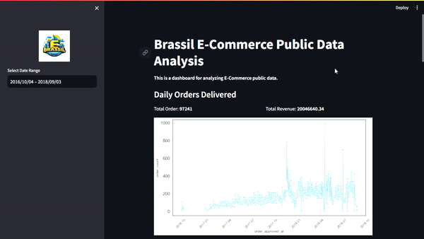

# Data Analyst Project Ecommerce Public Dataset ✨


## View Dashboard
[E-Commerce Data Dashboard Streamlit App](https://data-analyst-project-ecommerce-public-dataset.streamlit.app)

## Setup environment
```
conda create --name main-ds python=3.9
conda activate main-ds
pip install numpy pandas scipy matplotlib seaborn jupyter streamlit babel
```
## Installation
1. Clone this repository to your local machine:
```git clone``` [This Repository](https://github.com/zhavei/Data-Analyst-Project-Ecommerce-Public-Dataset.git)

2. Go to the project directory
```
cd Data-Analyst-Project-Ecommerce-Public-Dataset
```
3. Install the required Python packages by running:
```
pip install -r requirements.txt
```
## Run steamlit app
```
cd dashboard
streamlit run dashboard.py
```
## Method Explanation

The following steps outline the methodology employed in this analysis:

**1. Data Wrangling:**

- Data preparation and cleaning scripts are provided in the `dashboard.ipynb` file.
- These scripts handle tasks such as data type conversion, missing value imputation, and data normalization.

**2. Exploratory Data Analysis (EDA):**

- The provided Python scripts enable in-depth exploration and analysis of the data.
- EDA insights provide a comprehensive understanding of the patterns and trends within the e-commerce public data.

**3. Visualization:**

- An interactive data exploration dashboard is accessible through Streamlit.
- To launch the dashboard:
    ```bash
    cd dashboard
    streamlit run dashboard.py
    
- Open the dashboard in your web browser at `http://localhost:8501`.
    - The dashboard allows for interactive exploration of the data, providing visual insights into the key aspects of the e-commerce dataset.


